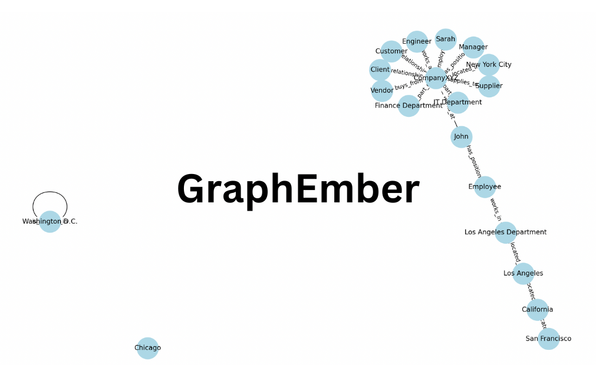

# GraphEmber

<p align="center">
  
</p>

GraphEmber is a Python project that demonstrates the creation and analysis of knowledge graphs and implements a simplified Graph Convolutional Network (GCN) for node classification on these graphs. This README provides an overview of the project, its components, and how to use it.

## Table of Contents
- [Introduction](#introduction)
- [Features](#features)
- [Requirements](#requirements)
- [Installation](#installation)
- [Usage](#usage)
- [Project Structure](#project-structure)
- [License](#license)

## Introduction

GraphEmber is a project that combines two main components:

1. **Knowledge Graph Generation**: It allows you to create a knowledge graph from entities and relationships. The knowledge graph is represented using the NetworkX library and can be visualized to understand the connections between entities.

2. **Graph Convolutional Network (GCN)**: It provides a simple implementation of a GCN layer. This layer can be used for node classification on knowledge graphs, showcasing the power of graph neural networks in handling structured data.

## Features

- Create and visualize knowledge graphs from entities and relationships.
- Implement a basic GCN layer for node classification on knowledge graphs.
- Demonstrate concepts such as self-loops, linear transformations, normalization, and aggregation of features on a graph.
- Easily extendable for more complex graph-related tasks and experiments.

## Requirements

To run this project, you need the following dependencies:

- Python 3.x
- NetworkX
- Matplotlib
- NumPy

You can install these packages using `pip`:

```bash
pip install networkx matplotlib numpy
